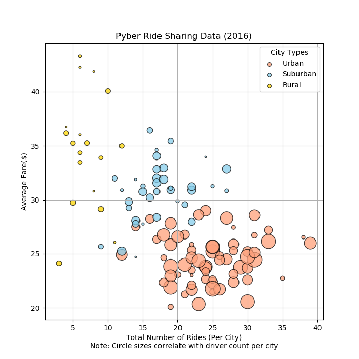
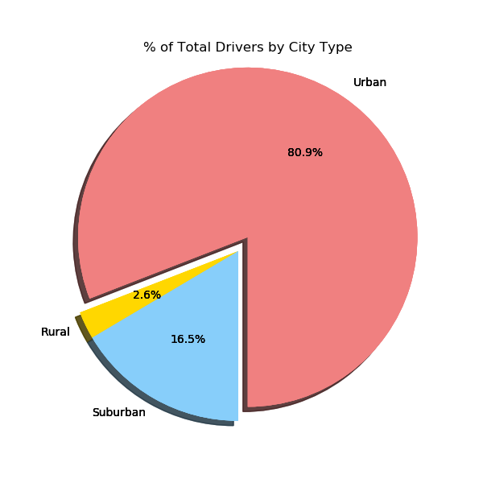
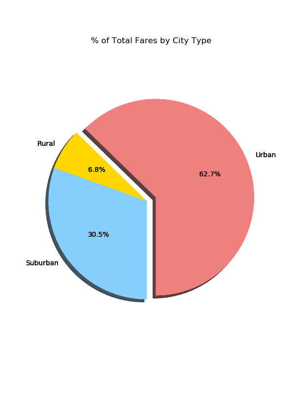
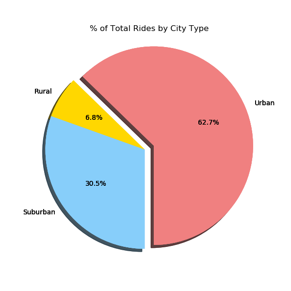

# Pyber, A Ride-Sharing Company,  Data Analysis & Visualization

## Project Scope:
Performed data analysis and created visualizations on a rural, sub-urban, and urban city ride-sharing data collected by the parent company using Python, Pandas, Matplotlib, and Jupyter Notebook.

### Prerequisites

* Python 3
* Jupyter Notebook

## Getting Started

* Download the repository
* Using Jupyter Notebook, open up the "python+pandas_matplotlib_pyber_analysis.ipynb"
* Clear and Restart the Kernel
* Run each cell and the the analysis and charts will come out as the output in the Jupyter Notebook, and the images will be saved where you cloned the repository on your computer.

## Analysis Findings:

### The data suggests the following:

##### Pyber Ride Sharing Scatter plot:

* Average fares in urban cities have a heavy concentration between the 20 to 30 USD range, and total number of rides have a volume between 20 to 30 rides. Whereas, suburban areas have variability in average fares between 25 to 37 USD. Majority of the total number of rides in suburban cities range between 12 to 20 rides. Whereas in rural areas, there is significantly higher variability in average fares ranging from 24 to 48 USD, and  limited number of total rides and drivers per city.  

##### % of Total Fares and Rides by City Type Pie Charts:

* Urban cities produced 62.7 percent of total fare revenue, and 68.4 percent of total rides of all three city types for the entire period. Suburban cities followed up with 30.5 percent of the fare revenues, and 26.3 percent of total rides. Rural cities only produced 6.8 percent of the remaining fare revenues, and 5.3 percent of the total rides. 

##### % of Total Drivers by City Type Pie Charts:

* Approximately 81 percent of Pyber drivers work in urban areas, where the average fares and volume of rides are significantly higher than the rural areas  (refer to % of Total Fares and Rides by City Type Pie Charts). Suburban areas have consistently fell into the middle ranges, bridging the gap between the urban and rural cities in terms of average fares, total volumes, and even in the type of cites Pyber drivers choose to work.

## Author

* **Johneson Giang** - *Individual Project* - [Github](https://github.com/jhustles)

## License

This project is licensed under the MIT License - see the [LICENSE.md](LICENSE.md) file for details